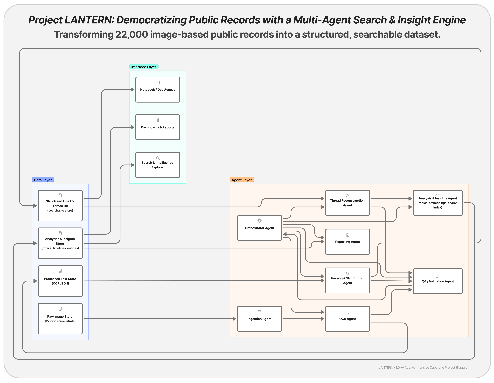
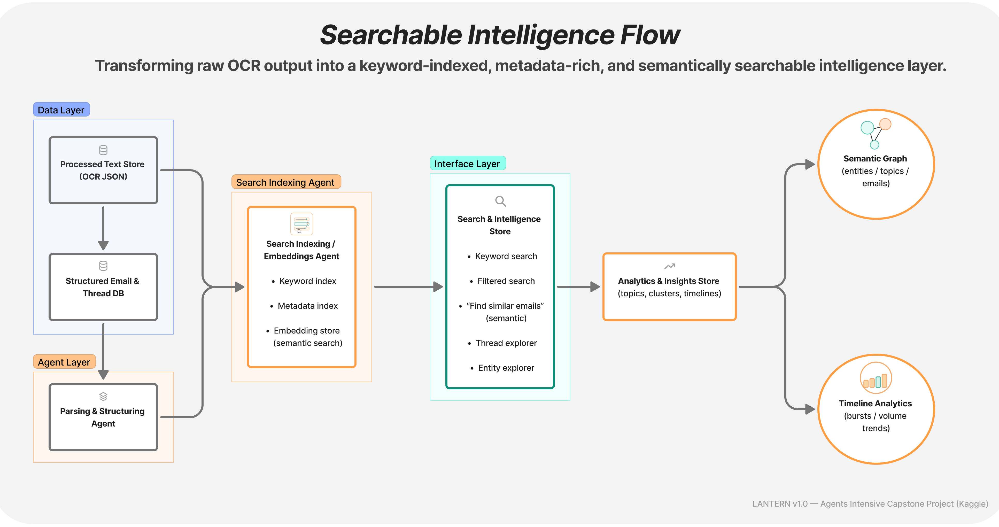

# 🏮 Project LANTERN  
### Multi-Agent OCR, Reconstruction & Insight Extraction System  
**Built for the Google AI Agents Intensive — 2025 Capstone**

Project LANTERN is a production-inspired, multi-agent pipeline that transforms noisy, unstructured document archives into clean, enriched, searchable intelligence.

Designed for **performance**, **traceability**, and **clarity**, the system uses modular agents to:

- 🔍 Perform OCR (Gemini Vision → OpenAI → Local Mock fallback)
- 🧵 Reconstruct multi-page threads from manifest metadata
- 🧠 Extract structured insights, summaries, entities, and metadata
- 🗂 Build a fast DuckDB search database  
- 📊 Present OCR + structured enrichment via interactive notebooks

This project demonstrates **real-world multi-agent system design**, **resilient fallback paths**, and a **polished, end-to-end data pipeline** fit for enterprise scenarios.

---

## 📐 Architecture Overview

Below is the core project flow as a **Mermaid system diagram** (renders automatically on GitHub):

flowchart TD
    A[Raw scans (JPG/PNG)] --> B[OCR Agent (Gemini / OpenAI / Mock)]
    B --> C[OCR outputs: raw_text, clean_text, confidence]
    C --> D[Threading Agent (sequence grouping)]
    D --> E[Extraction Agent: summaries, entities, search_text]
    E --> F[JSONL exports: pages.jsonl, sequences.jsonl]
    F --> G[DuckDB index (lantern.duckdb)]
    G --> H[Search & filtering (keyword + metadata)]
    E --> I[Notebook visualizations (image + OCR + insights)]

---

## 🧩 System Architecture

  

   
  <em>Figure 1 — High-level multi-agent architecture powering OCR, sequencing, enrichment, and search.</em>

---

## 🔍 Searchable Intelligence Flow Diagram

  

   
  <em>Figure 2 — How raw OCR output transforms into a structured, searchable intelligence layer.</em>

---

## 📦 Project Structure

project-lantern-agents-capstone/
│
├── agents/                          
│   ├── ocr_agent.py                     # Backend-agnostic OCR (Gemini → OpenAI → Mock)
│   ├── threading_agent.py               # Manifest-based thread reconstruction
│   └── extraction_agent.py              # Summaries, entities, enrichment
│
├── src/
│   ├── pipeline.py                      # Full pipeline runner (OCR → thread → extract)
│   ├── search_index.py                  # DuckDB search index builder
│   └── utils_env.py                     # Environment + configuration loader
│
├── tools/
│   ├── cleanup_tools.py                 # Text normalization helpers
│   ├── ocr_tools.py                     # OCR fallback + utility functions
│   └── jsonl_tools.py                   # JSONL read/write helpers
│
├── data/
│   ├── manifest.csv                     # Demo subset manifest
│   ├── images/                          # Input demo images (user-provided)
│   └── outputs/
│       ├── pages.jsonl                  # Page-level enriched OCR records
│       └── sequences.jsonl              # Thread-level reconstructed records
│
├── notebooks/
│   ├── demo.ipynb                       # Demo subset walkthrough
│   ├── project_lantern_capstone.ipynb   # Full capstone notebook
│   └── 0_Setup_and_Environment.ipynb
│
├── figures/
│   ├── project_lantern_architecture_diagram.png
│   ├── searchable_intelligence_flow_diagram.png
│   └── project_lantern_thumbnail.png
│
├── LICENSE
├── README.md
└── .gitignore

---

## 🚀 Key Features (Judge-Facing Summary)
🔍 1. OCR Agent — Resilient, Backend-Agnostic

- Gemini Vision → preferred
- OpenAI Vision → fallback
- Local deterministic stub → guaranteed execution
- Uniform output schema:

{
  "raw_text": "...",
  "clean_text": "...",
  "confidence": 0.91,
  "error": null
}

---

## 🧵 2. Thread Reconstruction Agent

- Uses manifest metadata (sequence_id, sequence_order)
- Gracefully handles missing fields
- Produces consistent sequence maps for extraction workflows
- Detects singletons automatically

---

## 🧠 3. Extraction Agent — Intelligent, Deterministic, Replaceable

- Page-level summaries
- Sequence-level summaries
- Lightweight entity extraction
- Search-ready search_text
- Deterministic mode (no LLM needed)
- Optional LLM-enhanced mode

---

## 🗂 4. DuckDB Search Database

- Fast, portable, single-file DB
- Indexes:
* OCR text
* Entities
* Categories
* Document types
* Summaries

Perfect for demonstration and extension.

---

## 📊 5. Notebook Visual Experience

- Side-by-side: scanned image + OCR + insights
- DuckDB search walkthrough
- Thread-level analysis

---

## 🔐 Environment & Authentication

Project LANTERN uses a .env file to keep credentials safe and portable.

.env Template (Do NOT commit real keys)

# ─────────────────────────────────────────────
# Project LANTERN — Environment Configuration
# ─────────────────────────────────────────────

# --- OpenAI (optional fallback OCR) ---
OPENAI_API_KEY="YOUR_OPENAI_API_KEY_HERE"

# --- Google Gemini / Vertex AI ---
# Primary Vertex API key
GCP_API_KEY="YOUR_VERTEX_API_KEY_HERE"

# Optional Gemini Studio key
GOOGLE_API_KEY="YOUR_GEMINI_STUDIO_KEY_HERE"

# GCP Project Info
GCP_PROJECT_ID="gen-lang-client-0048713898"
GCP_LOCATION="us-central1"

# Service account JSON (for IAM auth only)
GOOGLE_APPLICATION_CREDENTIALS=""

# Models
GEMINI_OCR_MODEL="gemini-1.5-flash"
GEMINI_VISION_MODEL="gemini-1.5-pro"

# Feature Flags
USE_OCR_CACHE="true"
ENABLE_ENTITIES="true"
ENABLE_SEQUENCE_SUMMARY="true"
ENABLE_DEBUG_LOGS="false"

# Pipeline Settings
OCR_TIMEOUT_SECONDS="30"
MAX_OCR_RETRIES="2"
MAX_SUMMARY_CHARS="600"

# Paths
PROJECT_ROOT="./"
DATA_ROOT="./data"
OCR_CACHE_DIR="./data/ocr_cache"
EXPORT_DIR="./data/outputs"

---

## 🔄 Authentication Rules (Local vs Kaggle vs GCP)

| Environment | Recommended Auth              | Key to Use                       | Notes                                     |
| ----------- | ----------------------------- | -------------------------------- | ----------------------------------------- |
| **Kaggle**  | Gemini Studio Key via Secrets | `GOOGLE_API_KEY`                 | Provided by the course                    |
| **Local**   | Vertex / Gemini API Key       | `GCP_API_KEY`                    | Loaded via `utils_env.load_environment()` |
| **GCP VM**  | Service Account JSON (IAM)    | `GOOGLE_APPLICATION_CREDENTIALS` | Auto-detected via ADC                     |

---

## ⚙️ Quickstart Guide

1️⃣ Install Dependencies

pip install -r requirements.txt

or minimal:
pip install duckdb python-dotenv pillow plotly pandas

---

2️⃣ Run the Pipeline

from src.pipeline import run_pipeline
from src.utils_env import load_environment
from agents.ocr_agent import OCRAgent
from agents.threading_agent import ThreadingAgent
from agents.extraction_agent import ExtractionAgent

cfg = load_environment()

ocr = OCRAgent.from_env(cfg)
threader = ThreadingAgent()
extract = ExtractionAgent.from_env(cfg)

pages, sequences = run_pipeline(
    manifest_df,
    ocr_agent=ocr,
    threading_agent=threader,
    extraction_agent=extract,
)

print(f"✅ Pipeline complete. Pages: {len(pages)}, Sequences: {len(sequences)}")

---

3️⃣ Query the DuckDB Intelligence Layer

from src.search_index import open_duckdb

con = open_duckdb("data/lantern.duckdb")

results = con.sql("""
SELECT *
FROM pages
WHERE search_text LIKE '%court%'
ORDER BY sequence_id, sequence_order
LIMIT 20;
""").df()

results.head()

---

## 📊 Notebook Demonstration

Use:
notebooks/5_Visualization_Walkthrough.ipynb

You’ll be able to:
- Display scanned pages
- Preview OCR output
- Explore extracted insights
- Analyze threads
- Run DuckDB keyword search

---

## 🏅 Why LANTERN Stands Out

✔ Professional multi-agent design
✔ Clear fallback chain for OCR robustness
✔ Deterministic + LLM-powered extraction options
✔ Thread reconstruction for hard document sets
✔ DuckDB search layer for instant intelligence
✔ Polished diagrams, documentation & demo workflow

---

## 👤 Author

**Payton K. Maurer**  
Senior Data Strategy & Digital Analytics Consultant  
Specializing in multi-agent systems, GA4/GTM architecture, and large-scale data pipelines.  

- 📧 payton.k.maurer@gmail.com   
- 🌐 LinkedIn: [https://www.linkedin.com/in/paytonmaurer](https://www.linkedin.com/in/paytonmaurer)

---

## 🤝 Acknowledgements

Built for the Google AI Agents Intensive (2025).
Special thanks to the cohort leads, reviewers, and community.
